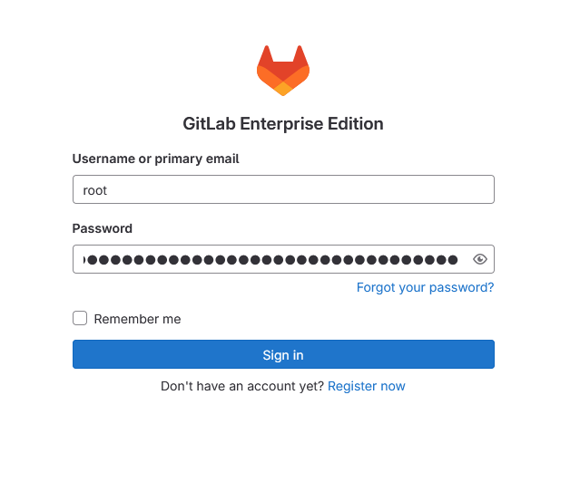
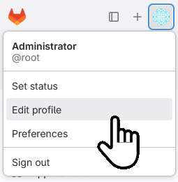

# Install and Configure GitLab

## Introduction

In this lab, we will install and configure a GitLab instance.
 
Siebel Cloud Manager uses GitLab to store the configuration of each deployment that it performs. Then, it will access the configuration files from GitLab to do the actual deployment.

Estimated Time: 40 minutes

### Objectives

In this lab, you will:
*   Deploy the GitLab stack
*   Configure HTTPS for GitLab
*   Upgrade GitLab for enhanced security
*   Generate a GitLab Access Token

### Prerequisites

* Oracle Cloud Infrastructure tenancy access
* PuTTY Client and SSH Key

## Task 1: Deploy the GitLab stack

In this task, we will visit the Oracle Architecture Center to deploy the GitLab stack. This stack will create a Virtual Machine with the GitLab application pre-installed in it.

During the stack creation, review all default values displayed. Confirm each value or enter a new value as appropriate for our task.

1. Click the following link to review documentation about deploying GitLab - [https://docs.oracle.com/en/solutions/deploy-gitlab-ci-cd-oci/index.html](https://docs.oracle.com/en/solutions/deploy-gitlab-ci-cd-oci/index.html)

2. In the Deploy section of this page, click the **Deploy to Oracle Cloud** link.

    

3. Check the region if necessary in case the deploy link changed it.

    

4. In the **Stack information** section, specify the **Compartment** in which to create the GitLab stack. In the SCM provisioning lab, a new sub-compartment was automatically provisioned as part of Task 2. To keep everything together, specify that compartment here.

    


5. Leave the default values for **Working Directory**, **Name**, **and Description**. Click ***Next***


6. In **Compute Configuration** section, specify the same compartment again for **Compute Compartment**. Complete the remaining options as shown below. Leave the default values for **External URL, Tag key name, and Tag value**

    **Availability Domain:**

        (Choose any available AD from the list)

    **Instance Name:**

        <copy>gitlab-server</copy>

    **DNS Hostname Label:**

        <copy>gitlabserver</copy>

    **Compute Shape:**

        VM.Standard.E3.Flex

    **Flex Shape Memory:**

        6

    **Flex Shape OCPUs:**

        1

    **Compute Image**

        (Choose the most recent image from the list)

    **Public SSH Key string**

        (Paste in (or choose) the SSH public key you used in the previous lab)

    **Network Compartment**

        (Copy the compartment you selected for the Compute Compartment above)

    **Network Strategy**

        Use Existing VCN and Subnet

    **Existing VCN**

        (Choose the VCN that was previously created by the Siebel Cloud Manager stack - it should be the only option for the selected compartment)

    **Subnet Type**

        Public Subnet

    **Existing Subnet**

        (Choose the Public Subnet that was previously created by the Siebel Cloud Manager stack)

    **Network Security Group Configuration**

        Use Recommended Configuration

7. Click ***Next***

8. Verify the configuration variables. To immediately provision the resources defined in the Terraform configuration, check that **Run Apply** is ticked
   
9. Click ***Create***

     The GitLab stack **apply** job should run successfully.

## Task 2: Configure HTTPS for GitLab

1. On the Oracle Cloud Console page, navigate to **Compute** and **Instances**.

2. In the **List Scope** section on the left side panel, choose the compartment used for the lab **scm-siebel\<date\>-cm**.

3. Note the Public IP address.

   

4. Connect to this instance via ssh or through an ssh client such as PuTTY using the ssh private key that we had created in Lab 1 and a username of **opc**

   ```
   $ <copy>ssh -i cloudshellkey opc@{Public IP of GitLab instance}</copy>
   ```

5. You can check the version of Gitlab installed as follows

   ```
   $ <copy>sudo gitlab-rake gitlab:env:info</copy>
   ```

6. After successful login, execute the following command to change to root user.

   ```
   $ <copy>sudo su</copy>
   ```

7. In the **/etc/gitlab/gitlab.rb** file, edit the **external_url** parameter as shown below using the vi editor, then save your changes and close the file.

   ```
   $ <copy>vi /etc/gitlab/gitlab.rb</copy>

   external_url 'https://{Public IP of the GitLab Instance}'
   ```

8. Create a self-signed certificates using OpenSSL. Run the following commands one by one to begin the process.

    > **Note:** Self-signed certificates are only suggested for this lab. Typically you will use Certificate Authority (CA) signed certificates. Follow [Gitlab's documentation to troubleshoot SSL issues](https://docs.gitlab.com/omnibus/settings/ssl/ssl_troubleshooting.html)

   ```
   $ <copy>mkdir -p /etc/gitlab/ssl</copy>
   ```
   ```
   $ <copy>chmod 755 /etc/gitlab/ssl</copy>
   ```
   ```
   $ <copy>cd /etc/gitlab/ssl</copy>
   ```
   ```
   $ <copy>openssl genrsa -out rootCA.key 2048</copy>
   ```
   ```
   $ <copy>openssl req -x509 -new -nodes -key rootCA.key -sha256 -days 365 -out rootCA.crt -subj "/C=US/ST=UT/L=Lehi/O=Oracle/OU=Support/CN=localhost"</copy>
   ```
   ```
   $ <copy>openssl genrsa -out {Public IP of GitLab instance}.key 2048</copy>
   ```
   ```
   $ <copy>openssl req -new -key {Public IP of GitLab instance}.key -out {Public IP of GitLab instance}.csr -subj "/CN=localhost"</copy>
   ```
9. Create a configuration file named **device-csr.conf**

   ```
   $ <copy>vi device-csr.conf</copy>
   ```

10. Populate this file with the following the save and close the file

   ```
   <copy>[req]
   distinguished_name = req_distinguished_name
   req_extensions = v3_req
   prompt = no

   [req_distinguished_name]
   C = US
   ST = UT
   L = Lehi
   O = Oracle
   OU = Corp
   CN = localhost

   [v3_req]
   keyUsage = nonRepudiation, digitalSignature, keyEncipherment
   extendedKeyUsage = serverAuth
   subjectAltName = @alt_names

   [alt_names]
   IP.1 = {Public IP of GitLab instance}</copy>
   ```

11. Run the following command to finally create a self-signed certificate

   ```
   $ <copy>openssl x509 -req -in {Public IP of GitLab instance}.csr -CA rootCA.crt -CAkey rootCA.key -CAcreateserial -out {Public IP of GitLab instance}.crt -extfile device-csr.conf -extensions v3_req -days 365</copy>
   ```

12. Reconfigure GitLab by running the below command.

   ```
   $ <copy>gitlab-ctl reconfigure</copy>
   ```

13. Prepare to copy **rootCA.crt** from Gitlab machine to SCM machine by creating a file on the Gitlab machine containing the SSH key.

   ```
   $ <copy>vi ~/cloudshellkey</copy>
   ```

14. Paste in the private key you created earlier then save the file and close it.

15. Change the permission of the private key so that it's not visible to other users

   ```
   $ <copy>chmod 600 ~/cloudshellkey</copy>
   ```

13. Copy the **rootCA.crt** from **/etc/gitlab/ssl** folder to the Siebel Cloud Manager instance's **/home/opc/certs** folder.

   ```
   $ <copy>scp -i ~/cloudshellkey rootCA.crt opc@{Public IP address for SCM instance}:/home/opc/certs</copy>
   ```

## Task 3:  Plan to keep your Gitlab instance up to date

1. Review [Gitlab's documentation for updating](https://docs.gitlab.com/ee/update/)

2. Keep an eye on [Gitlab's release page](https://about.gitlab.com/releases/categories/releases/) to be aware of new releases, the issues they fix, and the features they offer

## Task 4:  Generate a GitLab Access Token

We need to generate a GitLab Access Token that will be used in Lab 4 where we deploy Siebel CRM.

1. Launch GitLab using the following URL.

   ```
   <copy>https://{Public IP of GitLab Instance}</copy>
   ```

   > **Note:** Sometimes, we might encounter the **502 Error** upon launching the GitLab URL and refreshing the page at the time should display the right content.

   > **Note:** As we're using a self-signed certificate, your browser is expected to complain and ask for your explicit permission to access the security risk entailed.

2. Obtain the initial root user password, randomly generated during installation from the gitlab machine.

   ```
   $ <copy>ssh -i cloudshellkey opc@{Public IP of GitLab instance}</copy>
   ```
   ```
   $ <copy>sudo more /etc/gitlab/initial_root_password</copy>
   ```

2. Log in as root with the initial root password..

   

3. If you wish to change, the root password from the default, now is a good time. The file above will be deleted 24 hours after initial setup. Click on the user icon on the right hand side at the top left, and select **Edit Profile**

   

4. Now click the **Password** option on the left menu, and fill in the form to change the password, then click **Save password**.

   

5. In the left side panel, navigate to ***Access Tokens*** and then click **Add new token** on the right hand side.

   

6. Give the following values for the respective fields.

    **Name:**

        <copy>Siebel</copy>

    **Expires at:**

        {Give a future date not more than a year away}

    **Scope:**

        api

   

7. Scroll down and click ***Create Personal Access Token***.

8. Note the token displayed in the **Your new personal access token** field (click the eye icon to see, or the copy icon to copy to the clipboard).

   

## Summary

In this lab, the GitLab instance has been set up and configured. In the next lab, we will prepare a payload to send to the Siebel Cloud Manager API for deploying the Siebel CRM environment.

You may now **proceed to the next lab**.

## Acknowledgements

* **Author:** Duncan Ford, Software Engineer; Shyam Mohandas, Principal Cloud Architect; Sampath Nandha, Principal Cloud Architect
* **Contributors** - Vinodh Kolluri, Raj Aggarwal, Mark Farrier, Sandeep Kumar
* **Last Updated By/Date** - Duncan Ford, Software Engineer, May 2024